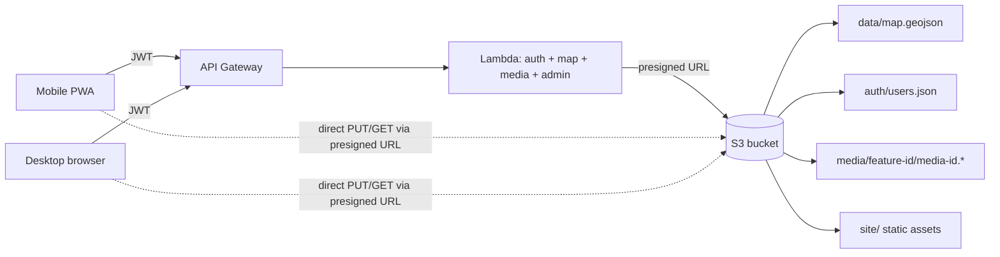

```markdown
---
name: cairn
overview: "Cairn: a MapLibre-based collaborative field-reporting PWA. GeoJSON map doc persisted to S3, photos/audio/video attachments as separate S3 objects, full offline support with region tile pre-download and an edit queue, mobile-first UI installable to iPhone home screen, AWS Lambda auth, and an admin UI for managing email/password credentials. Architecture designed so we can later swap the sync layer for real-time (Yjs + WebSockets) and wrap the PWA in Capacitor for unlimited iOS storage and background uploads, without rewriting the app."
todos:
  - id: repo_setup
    content: Create /Users/boraerden/Documents/tools/cairn, init git, create GitHub repo 'cairn', add monorepo structure (infra/ backend/ frontend/)
    status: pending
  - id: scaffold_infra
    content: Set up AWS CDK project with S3 bucket (site/ public via CloudFront, data/ auth/ media/ private), Lambda, API Gateway, and IAM
    status: pending
  - id: backend_auth
    content: Implement Lambda /login with bcrypt + JWT, and middleware to verify JWT on protected routes
    status: pending
  - id: backend_map
    content: Implement GET/PUT /map with ETag-based optimistic concurrency against data/map.geojson
    status: pending
  - id: backend_media
    content: Implement POST /media/presign (presigned PUT, kind in photo|audio|video, mime+size validation) and GET /media/:key (short-lived presigned GET) with per-user ownership metadata
    status: pending
  - id: backend_admin
    content: Implement admin CRUD endpoints for users.json, gated on role=admin
    status: pending
  - id: seed_admin
    content: Write a seed-admin script that creates the first admin user in auth/users.json
    status: pending
  - id: frontend_scaffold
    content: Scaffold Vite + React + TS app with login, map, admin routes, JWT auth hook, PWA manifest, icons, and service worker via vite-plugin-pwa
    status: pending
  - id: frontend_map
    content: Build MapView with MapLibre + Terra Draw (MapLibre adapter), uuid stamping, geolocation button, touch-sized controls, and FAB quick-add
    status: pending
  - id: frontend_editor
    content: Build responsive feature editor (sidebar on desktop, bottom sheet on mobile) with title, text notes, and attachment list
    status: pending
  - id: frontend_media
    content: Implement photo/video capture (input capture=environment), audio recording via MediaRecorder, client-side compression + thumbnails, direct-to-S3 upload via presigned URLs, inline playback
    status: pending
  - id: frontend_sync
    content: "Implement useMapDoc: load with ETag, debounced save, 409-conflict handling with auto-merge on disjoint feature IDs"
    status: pending
  - id: offline_queue
    content: IndexedDB-backed edit + media upload queue (via idb + Workbox Background Sync fallback); optimistic local state so UI stays responsive offline
    status: pending
  - id: offline_tiles
    content: Region picker (draw a box on map) that pre-downloads MapLibre vector tiles into Cache Storage, with progress UI and a storage-used indicator
    status: pending
  - id: frontend_admin
    content: "Build admin page: list users, add email/password form, delete user"
    status: pending
  - id: deploy
    content: Deploy infra, upload frontend build to CloudFront, seed admin, smoke-test desktop + iOS Safari end to end (add to home screen, offline trip simulation)
    status: pending
isProject: false
---

## Difficulty: Moderate — roughly a long weekend for v1

The easy parts: MapLibre rendering, GeoJSON CRUD, the admin UI. The slightly fiddly parts: AWS wiring (IAM, API Gateway, Lambda), getting optimistic concurrency right, and full offline (region tile pre-download + sync queue).

## Repo & working directory

- Local path: `/Users/boraerden/Documents/tools/cairn`
- GitHub repo: `cairn` (created via `gh repo create` during setup)
- Monorepo layout: `infra/` (CDK) + `backend/` (Lambda TS) + `frontend/` (Vite + React + TS)
- `pnpm` workspaces, one shared `types/` package for the feature schema used by both backend and frontend

## Native vs PWA decision

Ship v1 as a **PWA**, installed to your iPhone via Safari → Share → Add to Home Screen. Reasons:

- Zero distribution friction, no Apple Developer account needed.
- MapLibre, camera, mic, video, geolocation, IndexedDB, and service workers all work on iOS Safari 16+.
- Same codebase works on desktop unchanged.

Known iOS PWA limits (and the v1.5 escape hatch):

- Storage quota ~1 GB and evictable if iOS needs space (risk if phone sits a week between field trips with unsynced media).
- No true background uploads — queue only drains while app is open or recently foregrounded.

**Escape hatch (v1.5 if limits hurt):** wrap the same PWA bundle in **Capacitor**. Adds a thin native iOS shell → unlimited local storage, real background upload via `URLSession`, and proper native camera/video. Same React code, ~1 day of work. Distribute via free personal Apple ID signing (7-day re-sign with AltStore), or via TestFlight if you get a paid Developer account.

## Architecture



### S3 bucket layout

- `site/` — built frontend (served via CloudFront)
- `data/map.geojson` — shared FeatureCollection; features reference media by id, not by embedding bytes
- `media/<featureId>/<mediaId>.<ext>` — photos (jpg/webp), audio (webm/m4a), video (mp4/webm); private, accessed only via presigned GET (or CloudFront signed URLs)
- `media/<featureId>/<mediaId>.thumb.webp` — thumbnails (photos) or poster frames (videos), generated client-side before upload
- `auth/users.json` — array of `{ email, passwordHash (bcrypt), role }`; private, only Lambda reads it

### Feature schema (inside GeoJSON properties)

```ts
{
  id: string,              // uuid, stable for future Yjs keying
  title: string,
  note: string,            // plain text / simple markdown
  attachments: Array<{
    id: string,            // uuid
    kind: 'photo' | 'audio' | 'video',
    key: string,           // S3 key, e.g. media/<featureId>/<mediaId>.webm
    thumbKey?: string,     // photo thumb or video poster frame
    mimeType: string,
    size: number,
    durationMs?: number,   // for audio / video
    width?: number,        // for photo / video
    height?: number,
    createdAt: string,
    createdBy: string,     // user email
    syncStatus?: 'pending' | 'uploading' | 'uploaded'  // local-only field, stripped before save
  }>,
  createdAt: string,
  updatedAt: string,
  createdBy: string
}
```

### Lambda endpoints (single function, multiple routes)

- `POST /login` — verify bcrypt, return JWT (HS256, secret in env)
- `GET /map` — read `data/map.geojson`, return body + ETag
- `PUT /map` — write with `If-Match: <etag>` for optimistic locking; return 409 on conflict
- `POST /media/presign` — body `{ featureId, mediaId, mimeType, kind }`; returns presigned PUT URL + final S3 key (scoped so clients can't write outside `media/`)
- `GET /media/:key` — returns presigned GET URL (short TTL) for private read; frontend uses this to render ``/`<audio>` src
- `GET /admin/users` / `POST /admin/users` / `DELETE /admin/users/:email` — admin only

Seed the first admin via a one-off script that writes `auth/users.json`.

## Frontend structure

- Vite + React + TypeScript, installable as a PWA (manifest + service worker via `vite-plugin-pwa`)
- `maplibre-gl` for the map, `terra-draw` + `terra-draw-maplibre-gl-adapter` for drawing (framework-agnostic, MapLibre-native, no Mapbox dependencies)
- Pages: `/login`, `/map` (the collaborative editor), `/admin` (manage users; admin-only)
- Each feature gets a stable `id` (uuid) in properties — this is what makes the later Yjs/CRDT migration painless.

### Mobile-first UI

- Layout breakpoint at ~768px:
  - **Desktop**: map + right sidebar with feature editor
  - **Mobile**: full-screen map with a draggable **bottom sheet** (collapsed → peek → expanded) for the feature editor. Use a small library like `react-modal-sheet` or hand-roll with CSS snap.
- Big touch targets (min 44px), a floating "locate me" button (Geolocation API), and a big "+" FAB that opens a quick-add menu (point / line / polygon / photo-at-my-location).
- Quick-add flow on mobile: tap FAB → "Photo here" → opens camera → on capture, a point feature is dropped at current GPS with the photo already attached.
- Test on iOS Safari and Android Chrome — both support MediaRecorder and geolocation in PWAs.

### Media capture & upload flow

1. User taps "Add photo/video" → `<input type="file" accept="image/*|video/*" capture="environment">` (native camera on mobile, file picker on desktop).
2. User taps "Record audio" → `MediaRecorder` API, saves as webm/opus (iOS Safari fallback to mp4/aac; branch on `MediaRecorder.isTypeSupported`).
3. Client generates a uuid `mediaId`. Photos are downscaled to ~1600px + ~300px thumb via `browser-image-compression`. Videos get a poster-frame thumb extracted via a `<video>` + `<canvas>` snapshot (no transcoding in the browser — let the native camera pick an efficient codec).
4. The blob is saved to IndexedDB first and the attachment appears in the UI immediately with `syncStatus: 'pending'`. Upload is handed to the sync queue (see Offline below).
5. When online, queue worker calls `POST /media/presign` → gets presigned PUT URL → PUTs blob directly to S3 with `XMLHttpRequest.upload.onprogress` for progress → marks `uploaded` → triggers debounced `PUT /map` to persist the attachment entry.
6. On render, client calls `GET /media/:key` to get a short-lived signed URL; cache in memory per session. For offline viewing, the blob is already in IndexedDB (served via `URL.createObjectURL`).

### Offline strategy (full, v1)

Three pieces:

- **Shell + code:** `vite-plugin-pwa` in `injectManifest` mode precaches the app shell, JS, CSS, and icons. App boots with no network.
- **Edit queue:** every write (feature change, media upload) goes into an IndexedDB queue (via `idb`). A background worker drains the queue when `navigator.onLine` flips true, with exponential backoff. Workbox `BackgroundSyncPlugin` registers a sync event so the browser will also retry when the tab is reopened. UI shows a "3 pending" pill that expands to the queue on tap.
- **Region pre-download:** user draws a rectangle on the map → picks min/max zoom → client computes tile list for the vector style's sources → fetches each tile and stores in Cache Storage (or IndexedDB for protobuf blobs). A service worker `fetch` handler intercepts tile requests and serves from cache when offline. We expose a "Downloaded regions" screen with size + delete. Cap per region (e.g. 200 MB) and overall (e.g. 500 MB) to stay under iOS Safari's quota.

Conflict handling is the same as online: optimistic local state, debounced save with ETag, on 409 merge by feature id. Because each feature has a stable uuid, two phones editing *different* features offline will merge cleanly when both come back online. Two phones editing *the same* feature offline will produce a conflict prompt — acceptable in v1; v2 Yjs eliminates it.

## Key files to create

- `infra/` — AWS CDK stack: S3 bucket, Lambda, API Gateway, CloudFront, IAM. CDK is easier to read.
- `backend/src/handler.ts` — Lambda handler with a small router
- `backend/src/auth.ts` — bcrypt + JWT helpers
- `backend/src/media.ts` — presign helpers with prefix/size/mime validation
- `backend/scripts/seed-admin.ts` — one-off to create the first admin
- `frontend/src/map/MapView.tsx` — MapLibre + Draw, locate button, FAB
- `frontend/src/map/useMapDoc.ts` — fetch/save GeoJSON with ETag, debounce, conflict handling
- `frontend/src/editor/FeatureEditor.tsx` — responsive panel / bottom sheet
- `frontend/src/media/useMediaUpload.ts` — presign + direct S3 PUT + progress (drains from queue)
- `frontend/src/media/AudioRecorder.tsx` — MediaRecorder UI
- `frontend/src/media/PhotoCapture.tsx` — camera input + client-side resize/thumb
- `frontend/src/media/VideoCapture.tsx` — video camera input + poster-frame thumb
- `frontend/src/media/MediaView.tsx` — renders photos/audio/video from presigned URL or local IndexedDB blob
- `frontend/src/offline/db.ts` — IndexedDB schema (queue, media blobs, map doc snapshot)
- `frontend/src/offline/syncQueue.ts` — background drain worker, Workbox BackgroundSync fallback
- `frontend/src/offline/RegionDownloader.tsx` — rectangle picker, zoom range, tile fetcher with progress
- `frontend/src/offline/RegionsPage.tsx` — list downloaded regions, size, delete
- `frontend/sw.ts` — service worker (Workbox): precache shell, cache-first for tiles within downloaded regions, network-first for /map with cache fallback
- `frontend/src/admin/AdminPage.tsx` — list/add/remove users
- `frontend/src/auth/useAuth.ts` — JWT in localStorage, attaches `Authorization` header
- `frontend/public/manifest.webmanifest` + PWA icons (Cairn stacked-stones motif)
- `README.md` — install instructions including "Add to Home Screen" on iPhone

## Migration path to real-time (later, no rewrite)

1. Introduce a Yjs document where each feature is a map entry keyed by its uuid.
2. Add a WebSocket API Gateway route handled by the same Lambda (or a small Fargate task for persistent connections).
3. Lambda periodically exports the Yjs doc back to `data/map.geojson` — so S3 remains the source of truth and the async fallback still works.
4. Frontend swaps `useMapDoc` for `y-websocket` provider; the draw layer code is unchanged because feature shapes are identical.

## Costs / ops

- S3 + Lambda + API Gateway + CloudFront at low traffic: a few dollars/month at most, dominated by CloudFront egress once you have video.
- No database to run; `users.json` in S3 is fine up to low hundreds of users.
- MapLibre tile source: **OpenFreeMap** (free, no API key, good quality) or **MapTiler** free tier. Vector tiles are small and cache well for offline.
- Domain: optional, ~$12/yr. CloudFront gives you a free `*.cloudfront.net` URL to start.

## Installing on iPhone

Two supported paths; pick based on how rough the offline experience feels in practice:

1. **v1 (default):** PWA → Safari → Share → "Add to Home Screen". Full-screen launch, works offline for cached regions, syncs media when foregrounded with signal.
2. **v1.5 (if needed):** Wrap the same bundle with Capacitor, build in Xcode with free Apple ID, install via USB (re-sign weekly) or via AltStore. Gives unlimited storage and background uploads.

## Risks / gotchas

- Terra Draw's MapLibre adapter is first-class and tracks MapLibre releases — no Mapbox compatibility shim needed. Mode set covers point / line / polygon / rectangle / freehand / select out of the box.
- Serving the frontend from the same S3 bucket as private data requires careful bucket policy; use CloudFront in front of `site/` and keep `data/`, `auth/`, `media/` private (only reachable via presigned URLs).
- `users.json` in S3 is simple but not great beyond ~a few hundred users; swap for DynamoDB later if needed.
- **iOS Safari quirks**: MediaRecorder default codec is mp4/aac, not webm/opus — branch on `MediaRecorder.isTypeSupported`. Camera/mic requires HTTPS (CloudFront handles). "Add to Home Screen" PWAs get their own storage box separate from Safari's — don't test offline from Safari, test from the installed icon.
- **iOS storage eviction**: If the phone is idle for weeks, iOS can evict PWA storage including queued uploads. Mitigation: show a persistent "N items pending sync" warning, and move to Capacitor if this bites in practice.
- **Presigned URL TTLs**: keep PUT URLs short (~5 min) and GET URLs ~1 hour. Cap server-side by validating mime type and max size in the presign handler so a stolen token can't upload giant files. Enforce different size caps per kind (photo 10 MB, audio 20 MB, video 100 MB).
- **Orphan media**: if a user uploads media but the feature save fails, the blob is orphaned. Mitigation: a nightly Lambda that lists `media/` and deletes objects whose keys don't appear in the latest GeoJSON.
- **Recording length caps**: audio ~3 min, video ~60s; protects storage and avoids surprising users when big files sit in the offline queue.
- **Tile pre-download quotas**: enforce per-region and total caps; show a clear "using 230 / 500 MB" bar. Without this, a user downloads a whole city at z18 and the app silently dies.

```

```

